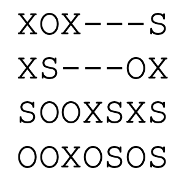

<h1 align="center">Cascade-Match</h1>

<div align="center">
   


</div>

<div align="center">
    
</div>

Cascade-Match is a fun and engaging puzzle game where players swap adjacent shapes to create chain reactions and clear the board! Inspired by classic match-three games, it challenges players to think strategically and plan their moves carefully.


## Table of Contents
- [Game Description](#game-description)
- [Implementation Details](#implementation-details)
- [How to Play](#how-to-play)
- [Installation](#installation)
- [Future Enhancements](#future-enhancements)
- [Acknowledgements](#acknowledgements)

## Game Description
In this game, the player is presented with a matrix containing different shape characters ('X', 'O', and 'S'). The objective is to create matches by swapping adjacent elements. When a match of three or more identical shapes is formed (either horizontally or vertically), those shapes are removed from the matrix, and the remaining elements fall down due to gravity.

### Game Mechanics:
1. The game board is a 2D matrix read from a text file.
2. Valid shapes are **'X'**, **'O'**, and **'S'**.
3. Players swap adjacent elements by specifying:
   - Row index (starting from **0**).
   - Column index (starting from **0**).
   - Direction ('r' for right, 'l' for left, 'u' for up, 'd' for down).
4. A valid swap must result in a match of **three or more identical shapes**.
5. After matches are cleared, **gravity** is applied, causing elements to fall down.
6. This may trigger **chain reactions**, where new matches are automatically cleared.

### Example Move:
#### **Before Move: `3 3 l`**
```
XOXOXOS
XSXXOOX
SOOXSXS
OOXOSOS
```
#### **After Move**
```
----XOS
XOX-OOX
XSX-SXS
SOOOSOS
```

#### **After Conseqeuent Match**
```
----XOS
X---OOX
XOX-SXS
SSX-SOS
```

## Implementation Details
The game is implemented in **C++** using:
- **2D vectors** for the game board (`std::vector<std::vector<char>>`).
- **File I/O operations** for reading the initial game state.
- **User input validation** and **error handling**.
- **Match detection** for horizontal and vertical matches.
- **Gravity simulation** to fill empty spaces after matches are cleared.

### Key Components:
- **Matrix Reading and Validation**: Ensures the input file has a valid matrix with consistent dimensions and only allowed characters.
- **Move Validation**: Checks if the player's move is valid (within bounds, not involving empty cells, and resulting in a match).
- **Match Detection**: Identifies and clears horizontal matches first, then vertical matches.
- **Gravity Application**: Makes elements fall down to fill empty spaces after matches are cleared.
- **Continuous Matching**: Automatically detects and clears new matches formed after gravity is applied.

## How to Play
1. Run the program.
2. Enter the filename containing the initial matrix.
3. The game will display the current state of the matrix.
4. Enter moves in the format: `row column direction`.
   - Example: `2 3 r` (swaps the element at row 2, column 3 with the element to its right).
5. Valid directions are:
   - **'r'** (right)
   - **'l'** (left)
   - **'u'** (up)
   - **'d'** (down)
6. To exit the game, enter `0 0 q`.

## Installation
1. Ensure you have a **C++ compiler** (e.g., `g++`).
2. Clone the repository:
   ```bash
   git clone <repo-url>
   ```
3. Compile the code:
   ```bash
   g++ -o cascade_match cascade_match.cpp
   ```
4. Run the game:
   ```bash
   ./cascade_match
   ```


## Future Enhancements
- Add a **scoring system** based on match size and chains.
- Implement a **graphical UI** using SFML or SDL.
- Introduce **new shapes or power-ups** (e.g., wildcards, bombs).

## Acknowledgements
This project was developed as part of the **CS204 Advanced Programming** course at **Sabancı University**. The implementation follows the requirements specified in the homework assignment.

